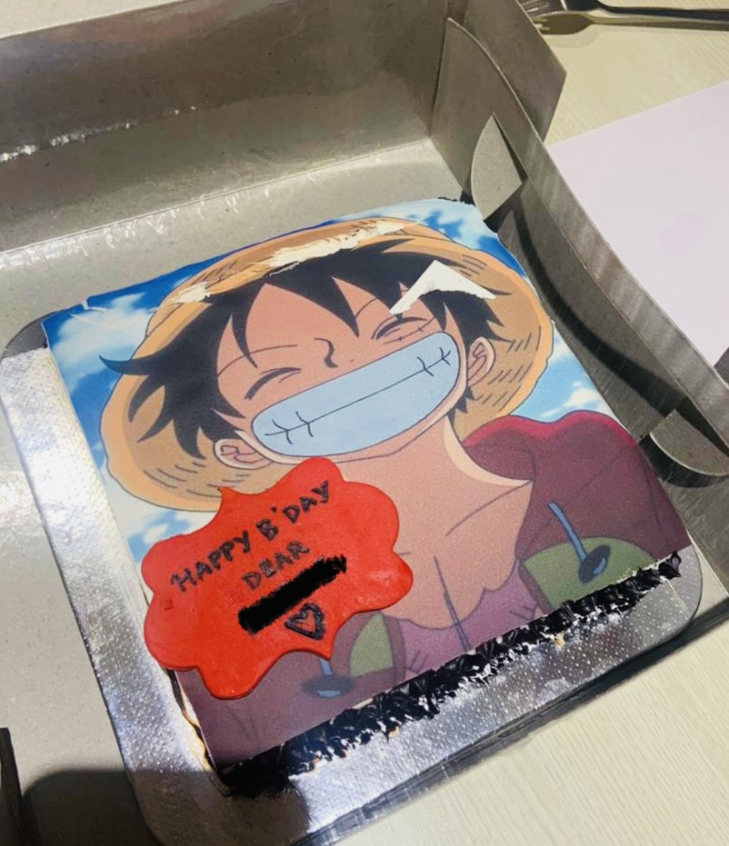

自己紹介をさせていただきます。

始めまして！インド出身のビビと申します。約２年間ほど日本語の勉強をしています。趣味は運動と読書です。暇な時には折り紙をしたり、ウクレレを弾いたりすることが好きです。大学では英語文学を専攻しましたが、それを選んだのは本が好きなだけでなく、言語として英語が好きだからです。私は多くの日本語学習者と同様に、アニメをきっかけに日本語を学び始めました。

一番好きなアニメはワンピースです。これは家族から私の２３歳の誕生日ケーキでした！家族がやっぱりすごいな。。。

このブログを始めた理由はいくつかありますので、ご紹介させていただきます。

子供の頃から書くことが大好きで、自分の気持ちを完全に伝えるのは書くときだけだと思います。以前から言語に興味がありましたが、日本語の勉強を始めたことでこの情熱がさらに高まりました。人生の道も大きく変わりました。

次の理由は、人生の最終目標が翻訳者になることです。以前は目標がなかったのですが、今は日本語だけでなく、日本社会や文化をより深く理解したいと思います。そのために、日本語力を向上させて翻訳にも挑戦してみたいです。

最後の理由ですが、このブログを通じて日本語や日本に興味を持っている方と繋がったり話したりしたいです。それが私にとって一番大切なことです。または、教育的なだけでなく、世界中の人々と一緒に日本語の勉強を楽しむことを目指していきたと思います。

コンテンツ的には、役に立つ勉強方法やJLPTについても含めた内容を書きたいと思います。また、書評や翻訳などについてもできるだけ取り上げたいです。それ以外にも、自分の好きなことや面白いと思うコンテンツを作りたいと思います。

このブログを読んでくださってありがとうございます。

私の下手くそ日本語を許してあげてください。

よろしくお願いします！

Hey there, fellow 人間! Thank you for checking my blog out. I really appreciate you.

I'm Bibi from India, and I have been studying Japanese for about two years now. My hobbies include working out, watching anime, and occasionally doing origami or playing the ukulele. In university, I majored in English Literature not for the books I enjoyed reading but for the language in which I read them.

Like many Japanese learners out there, my passion for the Japanese language began with watching anime. One Piece was my first "official" anime, and it will forever hold a special place in my heart. 

This was my 23rd birthday cake! Families really know how to make your birthday special. :’)

I started this blog for several reasons. Firstly, I have always loved writing because it allows me to express myself fully, a passion that has grown since childhood. This love for writing also extends to my fascination with languages. While I have always been interested in learning new languages, my enthusiasm has reached new heights ever since I discovered my love for Japanese. 

Secondly, studying Japanese has sparked my dream of becoming a translator. Before delving into the language, I didn't have a clear goal in life, but now I aspire to live in Japan where I can use Japanese and deepen my understanding of the culture more. Therefore, I figured that a personal blog would be an ideal platform for honing my skills and improving overall proficiency, both as a learner and an aspiring translator of the language.

Lastly, and perhaps most importantly, this blog serves as a means to connect with fellow learners who share similar interests. So, this blog serves not only an educational purpose but also as a platform where I can share my learning journey with people from around the world and foster meaningful connections. 

In terms of content, I share the learning methods that have helped me the most, including the JLPT. I also write reviews of books that I find interesting, both educational and non-educational, and simply anything I think is worth writing about. I hope to expand my content over time.

Thank you so much for taking the time to read this. 

Please feel free to leave your comments below! I cannot wait to connect with you.
